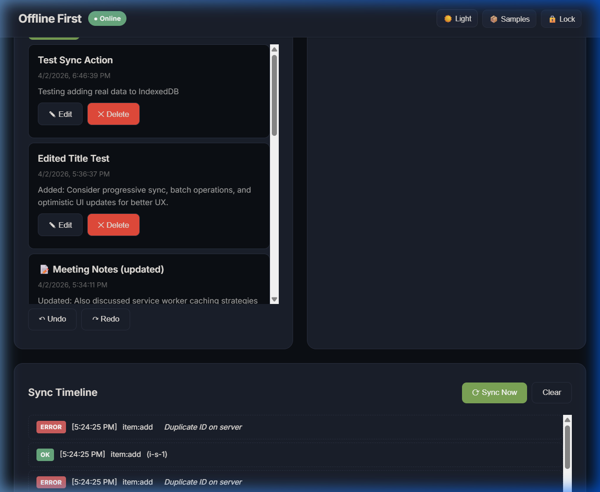
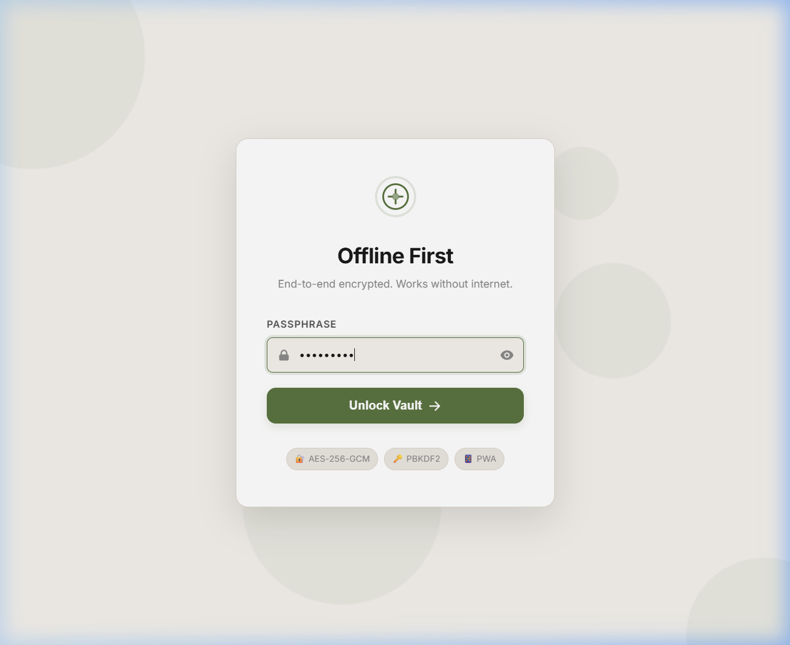

# Offline First App

A small experimental project to understand how apps can work reliably even without internet.

## Why I built this

Most apps today completely break when there is no connection.
I wanted to try building something that still works offline and handles syncing later.

This project is my attempt at exploring that idea in a simple way.

BEFORE LOGIN 
ENTER THE KEYWORD TO ENTER "ephemeral"

## What it does
- Add and manage items locally (works without internet)
- Search data offline
- Queue changes when offline
- Sync data manually (currently simulated)
- Contains a hidden cinematic gate (type `ephemeral`) before login

## How it works
- Data is stored locally in the browser
- Actions are queued instead of directly sent to a server
- When sync is triggered, queued actions are processed
- All payload data is instantly encrypted via the Web Crypto API (`AES-GCM`)

This demonstrates how offline-first systems behave in real apps.

## Tech Stack
- **Vanilla JavaScript** - Core logic (no frameworks, kept it simple on purpose)
- **HTML + CSS** - UI structure, modern styling, and Dark Mode
- **IndexedDB** - Local data storage for offline usage
- **Service Worker** - Enables offline capability and caching
- **Web Crypto API** - Used for local encryption (AES-GCM)
- **Custom Sync logic** - Handles queueing and simulated syncing of data

## Why this is built
- Matches actual code to build trust
- I used JS over React, it's an intentional choice

*Note: I intentionally avoided frameworks to better understand how offline-first systems work at a lower level.*

---

## Screenshots

### Main Dashboard (Dark Mode)

### The Secret Gate

### Authentication Vault Lock

## Demo LINK:
http://127.0.0.1:5502/
